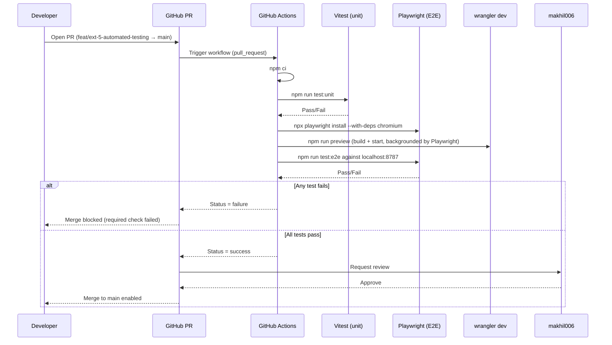

# High-Level Design (HLD)

## System Overview

This portfolio is a full-stack web application deployed as a single Cloudflare Worker. Every page and API route runs inside the same Worker process on Cloudflare's edge network, close to the visitor's location.

---

## Component Diagram

```
Browser
  |
  |  HTTPS
  v
+--------------------------------------------------+
|           Cloudflare Edge Network                |
|                                                  |
|  +--------------------------------------------+ |
|  |          Astro / Cloudflare Worker         | |
|  |                                            | |
|  |  Static pages  ──► ASSETS binding          | |
|  |  (pre-rendered HTML, CSS, JS)              | |
|  |                                            | |
|  |  API routes  ─────────────────────────┐   | |
|  |  /api/chat          │  /api/contact   │   | |
|  |  /api/posts         │  /api/login     │   | |
|  |  /api/external-data │  /api/logout    │   | |
|  +---------------------------────────────┘   | |
|                         │                       |
|         ┌───────────────┼───────────────┐       |
|         │               │               │       |
|         v               v               v       |
|  +-----------+   +------------+   +-----------+ |
|  | Cloudflare|   | Cloudflare |   | Cloudflare| |
|  |    D1     |   |     KV     |   |   Cache   | |
|  | (SQLite)  |   | (Sessions) |   |    API    | |
|  +-----------+   +------------+   +-----------+ |
|   submissions     session tokens   GitHub data   |
|   rate_limits                      (10 min TTL)  |
+--------------------------------------------------+
         |                                   |
         v                                   v
  +-------------+                   +----------------+
  | Resend API  |                   | Google Gemini  |
  | (email)     |                   | 2.5 Flash Lite |
  +-------------+                   | (AI chatbot)   |
                                    +----------------+
                                           |
                                    +----------------+
                                    | GitHub API     |
                                    | (profile stats)|
                                    +----------------+
```

---

## Component Responsibilities

| Component | Technology | Purpose |
|---|---|---|
| **Astro Worker** | Astro 6 + `@astrojs/cloudflare` | Renders pages, handles API routes, enforces rate limits |
| **D1 (SQLite)** | Cloudflare D1 | Stores contact form submissions, admin sessions, rate-limit counters |
| **KV (Sessions)** | Cloudflare KV | Fallback session store (binding: `SESSION`) |
| **Cache API** | Cloudflare Cache API | Edge-caches GitHub API responses for 10 minutes |
| **ASSETS** | Cloudflare Static Assets | Serves pre-rendered HTML, CSS, client JS, images |
| **Resend** | Resend transactional email | Delivers contact form submissions to inbox |
| **Gemini API** | Google Gemini 2.5 Flash Lite | Powers the "Ask My Résumé" AI chatbot |
| **GitHub API** | api.github.com | Source of public profile stats shown on the site |

---

## Request Flow Summary

### Static page (e.g. `/about`)
```
Browser → Cloudflare Edge → ASSETS binding → cached HTML response
```
Pre-rendered at build time; no Worker execution needed for subsequent visits.

### Contact form (`POST /api/contact`)
```
Browser → Worker → Rate limiter (D1) → Validate payload
       → D1 INSERT submission → Resend email → 200 OK
```
D1 write always happens before Resend so no message is ever lost.

### AI chat (`POST /api/chat`)
```
Browser → Worker → Rate limiter (D1) → Validate message
       → Build Gemini contents array with CV context
       → Gemini 2.5 Flash Lite API → extract reply → 200 JSON
```

### External data (`GET /api/external-data`)
```
Browser → Worker → Cache API hit? → return cached JSON (fast path)
                         ↓ miss
                   fetch github.com (5s timeout)
                         ↓ fail
                   return static mock data
```

---

## Security Controls

| Threat | Control |
|---|---|
| Brute-force / spam | IP-based rate limiting (D1, 1-hour rolling window) |
| XSS via stored input | Server-side `<`/`>` escaping before D1 insert |
| Session hijacking | HttpOnly + Secure + SameSite=Strict cookie |
| Secret leakage | All secrets in Cloudflare Workers secrets (not in code or `.dev.vars`) |
| Scope creep (AI) | System prompt hard-limits chatbot to CV-relevant topics only |

---

## Scalability Notes

- **Zero cold starts**: Cloudflare Workers run on V8 isolates, not containers — startup is sub-millisecond.
- **Global edge**: Requests are served from the nearest Cloudflare PoP (~300 worldwide).
- **D1 read replicas**: D1 automatically replicates reads to regional edge nodes (write goes to primary).
- **Cache API**: GitHub stats are cached at the edge for 10 minutes, preventing upstream rate-limit hits from repeated visitors.

---

## Testing & CI Infrastructure (Extension 5)

Before this extension, the repo had no test runner at all — `npm test --if-present` was a silent no-op. This adds a Vitest unit layer, a Playwright E2E layer, and a CI gate that blocks merges to `main` on any failure.

| Component | Responsibility | Depends on |
|---|---|---|
| `src/lib/*.test.ts` (Vitest) | Pure-function unit tests (e.g. the contact-form message counter) | Nothing — no network, no bindings, no browser |
| `e2e/*.spec.ts` (Playwright) | Browser-level checks: contact form fill/submit/success, dark-mode persistence across reload | A running Worker (`npm run preview` → real `wrangler dev`, port 8787) |
| `.github/workflows/ci.yml` | Runs both layers on every PR to `main`; uploads the Playwright report as an artifact on failure | GitHub Actions, branch protection rule on `main` |

No new external services or data stores are introduced. E2E tests run against the same D1/KV/AI bindings already defined in `wrangler.jsonc` — Playwright targets the real `wrangler dev` process rather than `astro dev`'s proxied bindings, so a broken binding wire-up would actually fail the suite instead of being masked.

```
PR opened
   │
   ▼
GitHub Actions (ci.yml)
   │
   ├── npm ci
   ├── vitest run ──────────────────► unit test results
   ├── npx playwright install
   └── npm run preview (build + wrangler dev, port 8787)
           └── playwright test ─────► e2e test results
   │
   ▼
All green? ── no ──► merge blocked, Playwright report uploaded for debugging
   │
  yes
   │
   ▼
makhil006 approval required ──► merge to main
```

### CI Sequence


